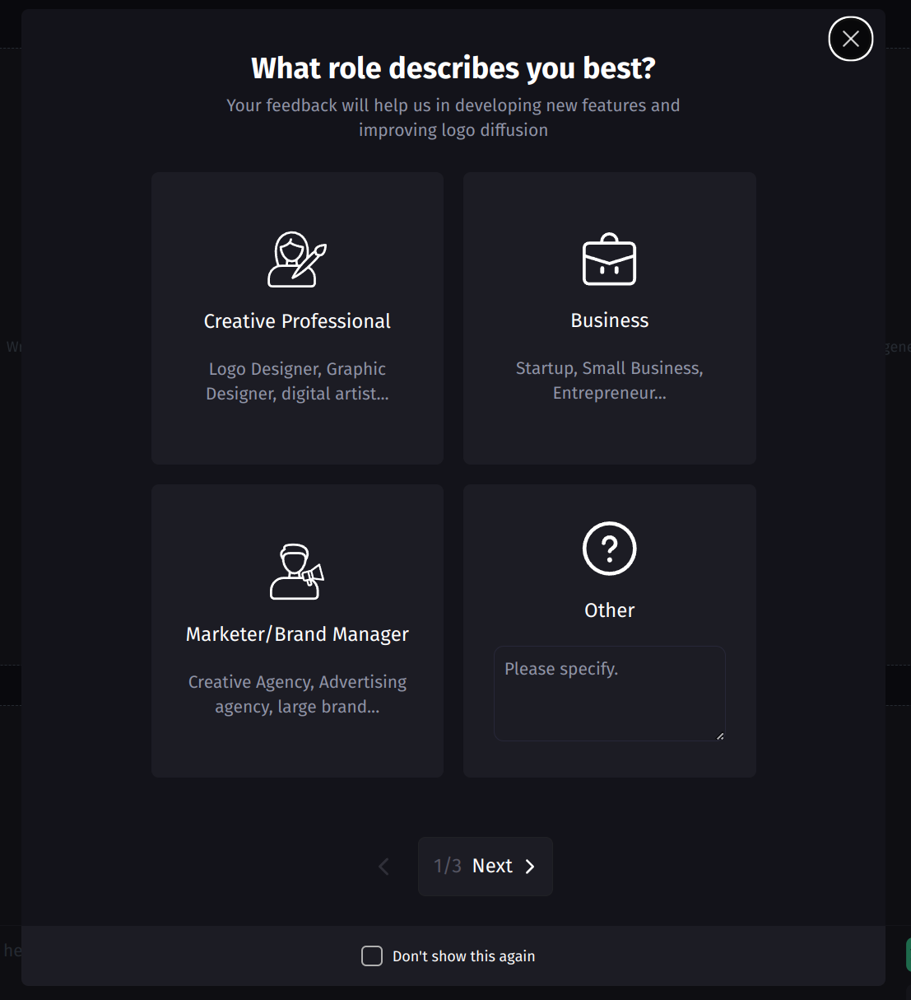

# Logo Diffusion Interview Task:

Definition: Implement the following functionalities for the modal

We're working on a modal for our app, its written in Tailwind/HeadlessUI inside the components, and your task is to add all the necessary actions to the modal so it's fully functional. The modal, `src/components/QuestionnaireModal.jsx` is supposed to ask a few questions, located in `src/components/questionnaire.js` from the users when they first login to the site. Each question has three predefined options, and an `Other` option which let's the users type in their desired answer. Currently, there are 3 questions in the config, but your implementation should be easily expandable with new questions. You should use redux thunk api and axios for making api calls, and setup a redux store for the app as well.

The modal requires a state to determine whether it's open or now. You should rewrite this state in redux as well, and make sure that it's true on page load, only if the current user hasn't answered these questions yet. You can use any setup you want for setting up a test user. You can use localStorage to keep track of it, or add it as a constant somewhere in the code. You can either change the user(email), or send a `delete` request to the backend, to reset this process for testing.

When the user clicks the `Next` button on the last question, you should submit the data to the backend. But if the user chooses to close the modal, nothing should be sent to the backend. If the user checks the `Don't show again` box, they shouldn't see this modal when they refresh the page on the same browser, even if they haven't answered yet.

Keep an eye on the `Other` textfield data, as you change the question, it should load the correct data for each question. 

You don't have to use redux for all your states, you can use local state whenever it's more suited. But the open/close state for the modal has to be implemented inside redux.

[Figma file](https://www.figma.com/file/lzxEDJ6Yo0nwPcIrVvlB8W/questionnaire?type=design&mode=design&t=tXptRLx3qh5BWkSJ-1)
# Requirements:
Here's a list of all that needs to be done for this test. Be sure to checkout [the backend documentation](https://qstnr.intvw.logodiffusion.com/docs/) before designing the state structures. Be sure to end all backend urls with an appending slash.

- [ ] Load question data from 'components/questionnaire.js'
- [ ] Move between the questions with next/previous button
  - [ ] Disable previous button when on the first question
- [ ] Load question options for each question
  - [ ] Setup the state for the modal
    - [ ] Setup the state as close to the API payload as possible, it should be expandable for future questions
  - [ ] On each question, when user chooses `Other`, they should be able to insert their answer in the text field below
  - [ ] The value for the `Other` should be set to empty when the user goes to the next/previous questions unless the user has already answered other for that question. In that case, you should load what they had typed before
  - [ ] If no option is selected and user clicks on `Next`, they should see an error indicating that they should select an option before continuing  
- [ ] API integration
  - [ ] Check the api [documentation](https://qstnr.intvw.logodiffusion.com/docs/)
  - [ ] Setup a redux store for the application and create a userSlice
  - [ ] Use thunkApi to check whether this user has submitted the questionnaire before
  - [ ] Only show the modal on page load if user hasn't answered the questions
  - [ ] Submit the answers when user answers the final question(thunkApi)
- [ ] `Don't show again`: When user chooses this option and closes the modal, the modal should not open on that browser again.
- [ ] If you have any suggestions or improvements regarding the UI/UX we'd love to hear it
